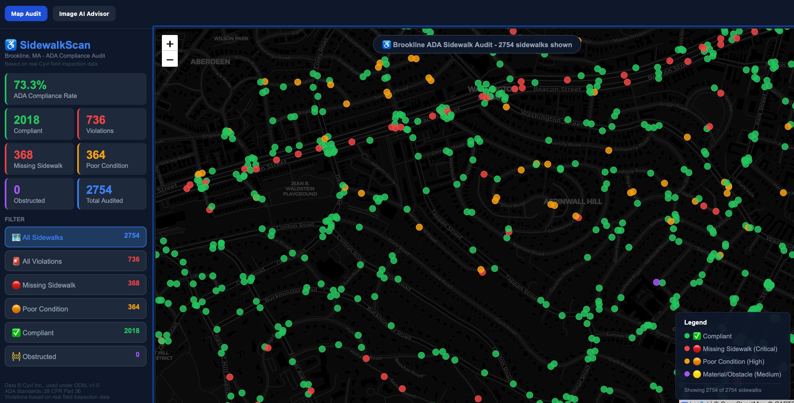
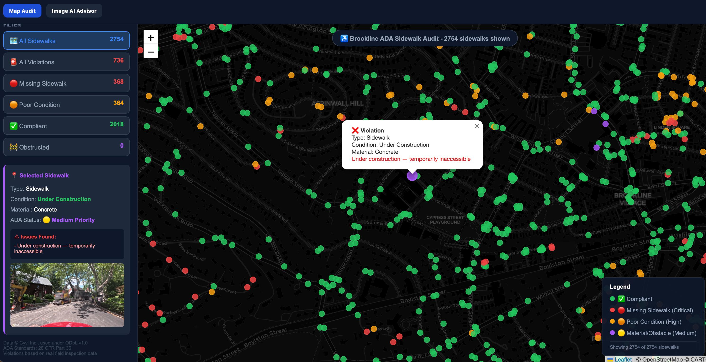
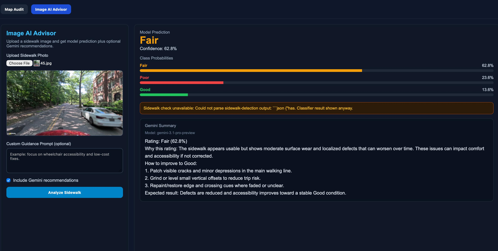

# Sidewalk Accessibility Validator (CYVL)

> [!IMPORTANT]
> **For full AI results, an API key is required.**
> The project runs without a key, but complete Image AI Advisor behavior (sidewalk presence check + detailed LLM guidance) works properly only when you provide a valid key (Llama via Groq or Gemini).

CYVL is a two-part accessibility project:

1. **Map Audit**: rule-based ADA audit on mapped sidewalk assets.
2. **Image AI Advisor**: predicts `Good / Fair / Poor` and generates improvement guidance.

## Final Live Deployment

- Frontend (Vercel): `https://sidewalk-acessibility-validator-cyv.vercel.app/`
- Backend API (Hugging Face Space): `https://srinivasasai-sidewalk-backend-hf.hf.space`
- Backend summary health check: `https://srinivasasai-sidewalk-backend-hf.hf.space/summary`

## Public-Ready Setup (Important)

This repo is prepared so **anyone can run it**.

- Model checkpoints are **not** committed to Git history.
- Backend can auto-download the public checkpoint from GitHub Releases using `MODEL_URL`.
- Users use **their own API key** (no private key is stored in code).

Default model URL:

- `https://github.com/Chava-Sai/Sidewalk-Acessibility-Validator-Cyvl/releases/latest/download/sidewalk_classifier_fair.pt`

## Llama First (Free Tier)

The default AI path is **Llama vision model via Groq**.

- Default model: `meta-llama/llama-4-scout-17b-16e-instruct`
- Provider value in API: `groq` (this means Llama via Groq)

Get a key and docs:

- Groq API keys: <https://console.groq.com/keys>
- Gemini API keys (Google AI Studio): <https://aistudio.google.com/api-keys>
- GroqCloud (start free): <https://groq.com/groqcloud/>
- Groq rate limits: <https://console.groq.com/docs/rate-limits>
- Groq vision docs: <https://console.groq.com/docs/vision>
- Groq models docs: <https://console.groq.com/docs/models>

Gemini is optional and can be selected from the UI.

## Project Structure

- `main.py` - FastAPI backend (map + prediction + AI summary)
- `frontend/` - React + Vite frontend
- `train.py`, `train_advanced.py` - training scripts
- `download_images.py`, `mask_images.py` - dataset preparation
- `requirements.txt` - backend dependencies
- `.env.example` - runtime configuration template
- `sidewalk_results_cache.json` - precomputed map audit cache for faster cloud cold starts
- `images/` - product screenshots

## Quick Start (Local)

### 1. Backend

```bash
python3 -m venv venv
source venv/bin/activate
pip install -r requirements.txt

# required for full Image AI Advisor output
export GROQ_API_KEY="your_groq_key"

uvicorn main:app --host 0.0.0.0 --port 8001 --reload
```

### 2. Frontend

```bash
cd frontend
npm install
echo 'VITE_API_BASE_URL=http://localhost:8001' > .env.local
npm run dev
```

Open: `http://localhost:3000` (or the next free port shown by Vite).

## Environment Variables

Copy from `.env.example`:

- `MODEL_PATH` - local `.pt` file path
- `MODEL_URL` - release asset URL used when `MODEL_PATH` is missing
- `SIDEWALK_CACHE_PATH` - path to precomputed map-analysis cache JSON
- `LLM_PROVIDER` - `groq` (Llama via Groq) or `gemini`
- `GROQ_API_KEY` - key for Llama via Groq
- `GROQ_MODEL` - vision model name
- `GEMINI_API_KEY`, `GEMINI_MODEL` - optional Gemini path

## Data + Model Release Strategy

Keep heavy files out of Git history. Upload them as Release assets:

- `dataset.zip`
- `dataset_masked.zip`
- `sidewalk_classifier_fair.pt` (public checkpoint)

This keeps cloning fast and still lets everyone run the app.

## Deployment (Permanent)

Current production architecture:

- **Frontend**: Vercel
- **Backend**: Hugging Face Space (Docker, free CPU tier)

Why this setup:

- Avoids Render free-tier memory crashes during model inference.
- Keeps frontend globally fast on Vercel.
- Keeps backend in a container with enough free RAM for PyTorch + model checkpoint.

## Product Screenshots




